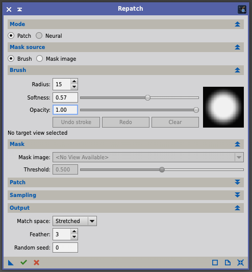
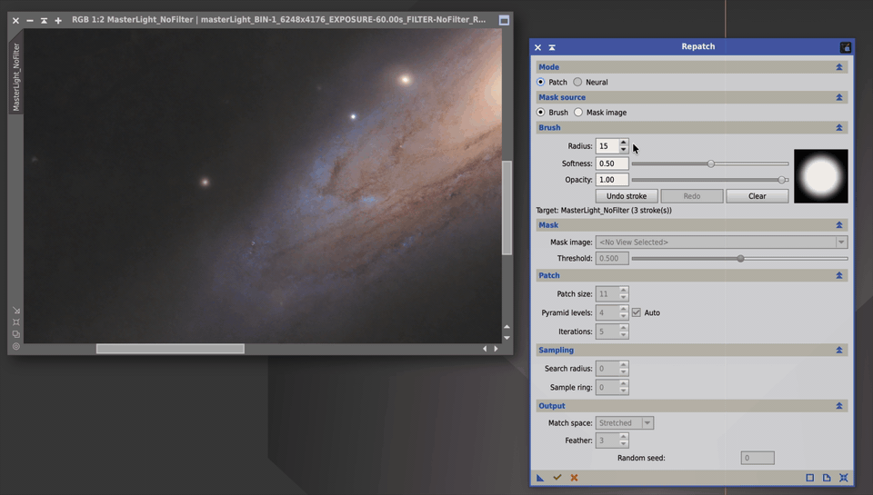

<p align="center">
  
</p>

# Repatch — content-aware fill for PixInsight

Repatch is a PixInsight process module that fills a masked region of an image
with plausible content synthesized from its surroundings, in the manner of
Photoshop's Content-Aware Fill / Patch tool. Mark the area (a mask image),
run the process, and the hole is replaced by background that matches the
texture, noise and gradient around it.

Phase 1 implements the classic multi-scale **PatchMatch** algorithm
(Barnes et al. 2009) — no neural network, no internet, deterministic when you
give it a seed. A `Neural` mode (ONNX inpainting) is planned as a later phase
and already appears, disabled, in the interface.

<p align="center">
  
</p>

**Demo** — removing stars with the brush; each stroke is filled as soon as it
is released:

<p align="center">
  <a href="images/demo.mp4"></a>
</p>

## Requirements

- macOS on Apple Silicon (arm64), Xcode Command Line Tools (clang 17+), CMake 3.20+
- PixInsight 1.9.4 Lockhart
- A PCL 2.10.4 checkout as a sibling directory `../PCL` (only needed to build)
- A PixInsight developer signing key (`.xssk`) to sign the module (only needed once per build)

## Install from the update repository

In PixInsight open **Resources → Updates → Manage Repositories…**, add

```
https://awitwicki.github.io/Repatch/
```

then **Resources → Updates → Check for Updates** and restart PixInsight when
asked. The module (`bin/Repatch-pxm.dylib`) and its documentation page are
installed together; `Repatch` appears under **Process → Painting**.

Requirements: PixInsight 1.9.4 on macOS / Apple Silicon. Until the module is
signed with a Certified PixInsight Developer identity, the packages are
signed with the author's *local* signing identity, which PixInsight only
trusts on machines where that identity has been registered (see below) —
installation on other machines fails with `Unknown code signing identity`.

## Build, sign, install

```bash
./build.sh          # builds PCL's static libs once, then core + tests + CLI + module
./sign_module.sh    # prompts for the .xssk password, writes bin/macosx/arm64/Repatch-pxm.xsgn
```

**One-time setup — register your local signing identity in PixInsight.**
Generating the `.xssk` (with the standard SigningKeys script) is not enough on
its own: PixInsight only trusts signatures whose public key it has loaded.
In PixInsight go to **Edit → Local Signing Identity…**, select your `.xssk`
file, enter its password, tick **Make the local signing identity persistent**,
and click OK — the console prints `* Local signing identity created.` Skipping
this gives `*** Error: Unknown code signing identity '<id>'` at install time.

Then in PixInsight: **Process → Modules → Install Modules…**, set the directory
to `bin/macosx/arm64`, click **Search**, then **Install**. `Repatch` appears
under **Process → Painting**.

**Optional — the in-app documentation page.** The dialog's *Browse
Documentation* button opens `<PixInsight>/doc/tools/Repatch/Repatch.html`.
The page is kept ready-made in the repository
([doc/tools/Repatch/](doc/tools/Repatch/), no compile step); install it with
`scripts/install_docs.sh` (the `doc` tree belongs to root, so it asks for
`sudo`). Release packages ship the same directory next to `bin/`.

**Continuous integration and releases.** Every push is built and tested on
GitHub's Apple Silicon runners ([.github/workflows/build.yml](.github/workflows/build.yml));
the artifact is an *unsigned* package, because only the PixInsight core can
produce module signatures. Releases are signed locally (`./sign_module.sh`),
packaged (`scripts/package.sh`), published as a GitHub Release and as a
PixInsight update repository on GitHub Pages (`scripts/make_repo.sh`) — see
the [developer guide](docs/developer-guide.md#releases-and-the-update-repository).

## Quick start

**Brush (default).** Open **Process → Painting → Repatch**, then click on the
image you want to fix — it becomes the session target. Press and
drag over the defect; when you release the button the stroke is filled
immediately. Paint as many strokes as you need (`Ctrl+Z` undoes the last one,
`[` / `]` change the radius), then press **✔** to commit the whole session as a
single history entry, or **✘** to discard it. The committed instance carries
the strokes and the seed, so dragging it onto a fresh copy of the image
reproduces the same pixels.

**Mask image.** Switch *Mask source* to *Mask image*, pick a mono image with
the same dimensions as the target (white = fill), and press **✔** with the
target view active. Useful for scripted or batch work (PixelMath / StarMask
masks).

For linear astro data keep **Match space = Stretched** (the default); use
**Sample ring** to keep sources local. See [docs/user-guide.md](docs/user-guide.md)
for every parameter.

## Command-line harness

`build/repatch-cli` runs the same core on FITS files without PixInsight —
useful for debugging and regression checks:

```bash
./build/repatch-cli image.fits mask.fits out.fits --patch 11 --ring 40 --seed 1
```

## Documentation

- [User guide](docs/user-guide.md) — parameters, workflow, troubleshooting
- [Developer guide](docs/developer-guide.md) — layout, build internals, core API, how to add a backend
- [Algorithm](docs/algorithm.md) — what the code does and why

## License

Not yet chosen by the author. Until a `LICENSE` file is added, all rights are
reserved. PCL itself is distributed under the PixInsight Class Library License.
