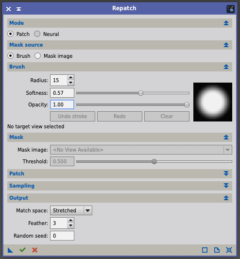
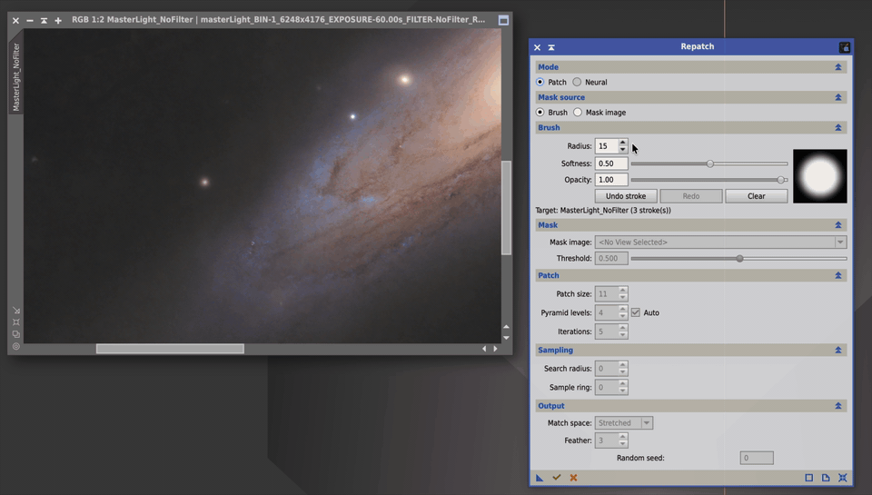

<p align="center">
  
</p>

# Repatch — content-aware fill for PixInsight

Repatch replaces a marked region of an image with plausible content
synthesized from its surroundings, in the manner of Photoshop's Content-Aware
Fill. Mark the defect, run the process, and the hole is filled with background
that matches the texture, noise and gradient around it.

Satellite trails, dust motes, stray stars, a bad column, the ghost of a
removed artefact — anything where you want the area to simply look like the
sky around it.

Repatch uses the classic multi-scale **PatchMatch** algorithm: no neural
network, no internet connection, and deterministic — the same seed gives you
the same pixels every time, so a result is reproducible months later. (A
`Neural` mode appears in the interface, greyed out; it is planned for a later
release.)

<p align="center">
  
</p>

**Painting out stars with the brush.** Each stroke is filled the moment you
release the mouse button:

<p align="center">
  <a href="images/demo.mp4"></a>
</p>

## Install

In PixInsight open **Resources → Updates → Manage Repositories…** and add:

```
https://awitwicki.github.io/Repatch/
```

Then **Resources → Updates → Check for Updates**, and restart PixInsight when
it asks. Repatch appears under **Process → Painting**, and its documentation
page is installed with it — the *Browse Documentation* button in the dialog
will work straight away.

| Platform | PixInsight |
| --- | --- |
| macOS, Apple Silicon | 1.9.4 or 1.9.5 Lockhart |
| Windows, x64 | 1.9.5 Lockhart |

There is no Intel macOS or Linux build.

## Quick start

**With the brush (the default).** Open **Process → Painting → Repatch** and
click the image you want to fix — that click chooses the target for the whole
session. Now press and drag across a defect; when you release the button the
stroke is filled immediately, so you see the result as you work.

Paint as many strokes as you like:

- `Ctrl+Z` undoes the last stroke, `Ctrl+Shift+Z` redoes it
- `[` and `]` make the brush smaller and larger

When you are happy, press **✔** to commit the whole session as a single
history entry, or **✘** to throw it away. The committed instance remembers
every stroke and the random seed, so dragging that instance onto a fresh copy
of the image reproduces exactly the same pixels.

**With a mask image.** Switch *Mask source* to *Mask image* and pick a mono
image with the same dimensions as the target, where white marks what to fill.
Make the target view active and press **✔**. This is the route for scripted
and batch work, and it takes masks from PixelMath, StarMask or anywhere else.

**For linear astronomical data** leave *Match space* on **Stretched**, which is
the default, and use *Sample ring* to keep Repatch borrowing texture from near
the defect rather than from across the frame. The
[user guide](docs/user-guide.md) explains every parameter.

## Documentation

- **[User guide](docs/user-guide.md)** — every parameter, the full workflow,
  and what to do when a fill looks wrong
- **[How it works](docs/algorithm.md)** — the algorithm, in plain terms

Building Repatch from source, the module internals, releases: see the
**[developer guide](docs/developer-guide.md)**.

## License

Not yet chosen by the author. Until a `LICENSE` file is added, all rights are
reserved. PCL itself is distributed under the PixInsight Class Library
License.
